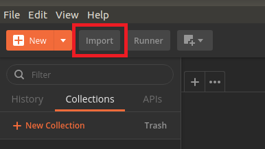
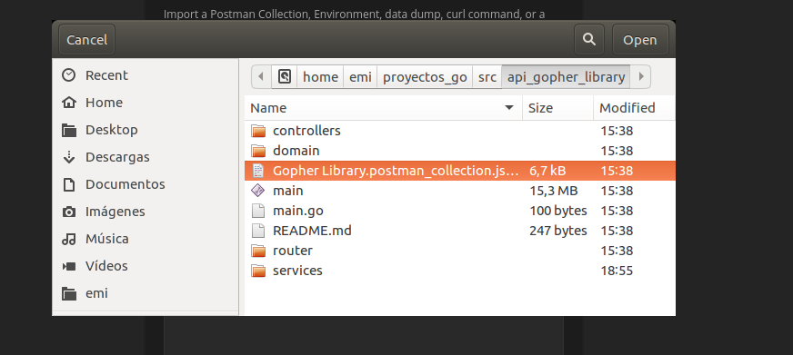
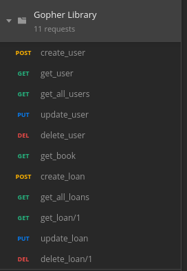

# Gopher Library


## Go read with me!

This is an API in language programming GO. Here you to do request to Google Books API the books you most want to read. 
You can to create users and manage them, also each user can to create loans of some books and manage them. OK let's GO!!!

The project is divided in a model MVC (Model View Controllers) and its organization is the next: 

* **router**: this interfaces between the endopoint and its corresponding controller.
* **controller**: this is the intermediary between the router and the services. It handles the rest messages.
* **services**: this contains the business logic.
* **domain**: this contains the structs and interfaces to development of the API.

## Contents

- [Gopher Library](#gopher-library)
  - [Go read with me!](#go-read-with-me)
  - [Contents](#contents)
  - [Requirements to use API](#requirements-to-use-API)
  - [Quick Start](#quick-start)
  - [Requeriments](#requeriments)
  - [Endpoints](#endpoints)
  - [Testing](#testing)

## Requirements to use API

To start using the API you need installed the next:

* *go*: to install GO according to your OS, visit the official website: https://golang.org/
* *gin-gonic*: to install this framework in the repository in github, there's an explanationof how to install it: https://github.com/gin-gonic
* *postman*: to install this program you should visit: https://www.postman.com/ 

## Quick Start

You should download the repository and move it to the `../projects_go/src/..` folder. To use the API you must open Postman and import the `Gopher Library.postman_collection.json` collection for REST testing. 

Steps to import collections:

1. To import the collection in postman:


2. And select the collection:


3. Final result:           


Then in the terminal, move to the folder where 'main.go' is located and run the API with the following command:

```console
go run main.go
```

Now, you test any endpoint.

## Requeriments

The requirements that we propose for this project are the following
* CRUD (Create Read Update Delete) Users
* CRUD (Create Read Update Delete) Loans
* Consume an External API (Google Books API was selected)
* Read books
* To control the number of copies per book, we decided to put a fixed number (5) for all books.
* Control that the user cannot ask for books if he has expired loans

## Endpoints


**USERS**

| Method      | Endpoint        |                 URL                  | Required body  |
|:-----------:|:---------------:|:------------------------------------:|:--------------:|
|     GET     | /getUser/:id    | http://localhost:8080/getUser/:id    |   Only param   |
|     GET     | /getAllUser     | http://localhost:8080/getAllUser     |   No           |
|     POST    | /createUser     | http://localhost:8080/createUser     |   Yes          |
|     PUT     | /updateUser     | http://localhost:8080/updateUser     |   Yes          |
|     DELETE  | /deleteUser/:id | http://localhost:8080/deleteUser/:id |   Only param   |

**LOANS**

| Method      | Endpoint        |                 URL                  | Required body  |
|:-----------:|:---------------:|:------------------------------------:|:--------------:|
|     GET     | /getLoan/:id    | http://localhost:8080/getLoan/:id    |   Only param   |
|     GET     | /getAllLoans    | http://localhost:8080/getAllLoans    |   No           |
|     POST    | /createLoan     | http://localhost:8080/createLoan     |   Yes          |
|     PUT     | /updateLoan     | http://localhost:8080/updateLoan     |   Yes          |
|     DELETE  | /deleteLoan/:id | http://localhost:8080/deleteLoan/:id |   Only param   |

**BOOKS**

| Method      | Endpoint        |                 URL                  | Required body  |
|:-----------:|:---------------:|:------------------------------------:|:--------------:|
|     GET     | /getBook/:id    | http://localhost:8080/getBook/:id    |   Only param   |

## Testing

We have tested the files `services.go` and `domain.go`. To run the GO test, you must position yourself in these folders and use the following commands on the terminal:

* run the complete test:
```console
go test 
```
* runs the full test but with the percentage coverage:
```console
go test -cover 
```
